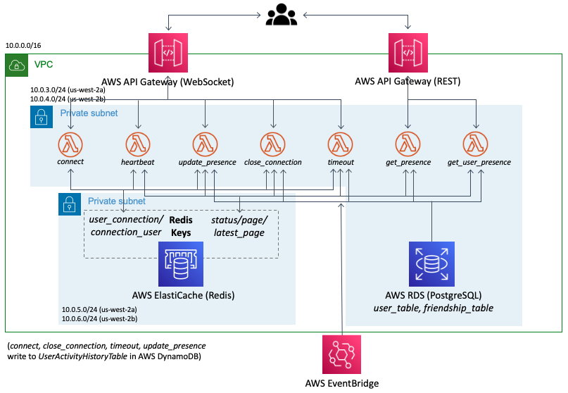

# presence-api

[](https://circleci.com/gh/PageNow/presence-api/tree/main)


API for presence information

## Architecture

### API Architecture Overview Diagram


### API Architecture Details Diagram



## Components

### AWS RDS (Postgres)

* We expose AWS RDS via AWS RDS Proxy.
* The schema is defined in [user-api](https://github.com/PageNow/user-api).
* The permission for Lambda to access AWS RDS Postgres is set up in `lib/presence-api-stack.ts`.

### AWS Elasticache (Redis)

We use a single REDIS client cluster with four fields - `presence_user_connection`, `presence_connection_user`, `status`, `page`.

* `presence_user_connection` stores { user_id: connection_id } and `presence_connection_user` stores { connection_id: user_id }. They are used to manage connection ids for each user.
* `status` stores { user_id: timestamp } with timestamp as score. It is used to determine whether a user is online or not.
* `presence` stores { user_id: page strin } where page string is a JSON string of { url: string, title: string }. It is the _url_ and _title_ of tabs users are on.

### AWS Lambda

Provides all the presence related functionalities with serverless framework.

* `connect` is invoked via websocket when a user connects to it. It stores the user's connection id in *presence_user_connection* and *presence_connection_user* Redis field.
* `heartbeat` is invoked every minute via websocket from the Chrome extension. It updates the timestamp of _status_ Redis field.
* `update_presence` is invoked via websocket when user switches the Chrome page. It updates timestamp of *status* Redis field and page information of *page* Redis field.
* `close_connection` is invoked via websocket when user closes websocket connection. It removes user's information (connection id, timestamp, and page information) from all Redis fields. 
* `timeout` is invoked every 3 minutes by AWS Eventbridge to identify offline users and remove their information from Redis.
* `get_presence` is invoked via REST Api. It returns the presence information of every friend of the user who invokes the function.
* `get_user_presence` is invoked via REST Api. It returns the presence information of the target user provided by the caller.

### AWS API Gateway

* REST API - Provides endpoint for retrieving the current snapshot of presence data of users.

* Websocket API - Provides websocket connection for Chrome extension `background.js` to send and retrieve real-time presence data.

### AWS EventBridge

CloudWatch triggers EventBridge event every minute to invoke Lambda `timeout` function.

## Setup

### Environment Variables

In `.env` set the following environment variables.
```
AWS_REGION=<AWS region>
COGNITO_POOL_ID=<AWS Cognito User Pool Id>

VPC_ID=<VPC of the backend>
PRIVATE_ROUTE_TABLE_ID=<Route Table id of subnets AWS RDS resides in>
PRIVATE_SUBNET1_ID=<Id of subnet1 AWS RDS resides in>
PRIVATE_SUBNET2_ID=<Id of subnet2 AWS RDS resides in>

SUBNET1_AZ=<Availability zone of subnet1 (e.g. us-west-2a)>
SUBNET2_AZ=<Availability zone of subnet2>

RDS_PROXY_SG_ID=<Security Group of AWS RDS Proxy>
RDS_HOST=<AWS RDS Host>
RDS_PORT=<AWS RDS Port Number>
RDS_USERNAME=<AWS RDS username>
RDS_PASSWORD=<AWS RDS password>
RDS_DB_NAME=<AWS RDS database name>

RDS_PROXY_ARN=<AWS RDS Proxy arn>
RDS_PROXY_NAME=<AWS RDS Proxy name>

LAMBDA_SG_ID=<AWS Lambda Security Group if it exists. 'none' otherwise>
REDIS_SG_ID=<AWS Elasticache Security Group if it exists. 'none' otherwise>
REDIS_PRIMARY_ENDPOINT_ADDRESS=<Elasticache primary endpoint host if it exists. 'none' otherwise>
REDIS_PRIMARY_ENDPOINT_PORT=<Elasticache primary endpoint port if it exists. 'none' otherwise>
REDIS_READER_ENDPOINT_ADDRESS=<Elasticache reader endpoint host if it exists. 'none' otherwise>
REDIS_READER_ENDPOINT_PORT=<Elasticache reader endpoint port if it exists. 'none' otherwise>

CLIENT_URL=<Url of the chat client>
```

### CDK Bootstrap

For initialization, bootstrap AWS CDK by runnin
```shell
cdk bootstrap aws://257206538165/us-east-1
```
Refer to https://docs.aws.amazon.com/cdk/latest/guide/bootstrapping.html for more details.

## Running Locally

### Run Redis on Docker

Run
```shell
cd redis-docker
docker-compose up -d
```

### Invoke Lambda Functions

Run ```cdk synth --no-staging > template.yaml``` to generate template.yaml.

Check the function identifier from template.yaml and run
```shell
/usr/local/bin/sam local invoke [FunctionIdentifier] -e events/[event.json]
```

## Deployment

Run
```shell
cdk deploy --outputs-file presence.json
```

## References

* https://github.com/aws-samples/aws-appsync-presence-api
* https://aws.amazon.com/ko/blogs/gametech/building-a-presence-api-using-aws-appsync-aws-lambda-amazon-elasticache-and-amazon-eventbridge/

### Local testing

* https://github.com/aws/aws-sam-cli/issues/318#issuecomment-377770815

### APIGateway Websocket

* https://aws.plainenglish.io/setup-api-gateway-websocket-api-with-cdk-c1e58cf3d2be
* https://docs.aws.amazon.com/cdk/api/latest/docs/aws-apigatewayv2-readme.html#websocket-api
* https://docs.aws.amazon.com/cdk/api/latest/docs/aws-apigatewayv2-readme.html#websocket-api
* https://github.com/aws-samples/simple-websockets-chat-app/blob/master/onconnect/app.js

### VPC Import

* https://bobbyhadz.com/blog/import-existing-vpc-aws-cdk

### Lambda RDS Proxy
* https://itnext.io/work-with-aws-rds-proxy-9d7e09668080

### JWT decoding

* https://github.com/awslabs/aws-support-tools/tree/master/Cognito/decode-verify-jwt
