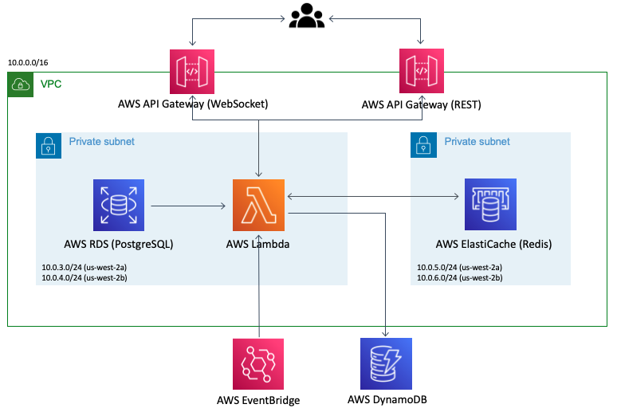

[English README.md](./README.md)

PageNow 홈페이지: https://pagenow.io <br/>
PageNow 크롬 웹스토어: https://chrome.google.com/webstore/detail/pagenow/lplobiaakhgkjcldopgkbcibeilddbmc

# Presence API

[](https://circleci.com/gh/PageNow/presence-api/tree/main)

Presence API는 실시간 활동 공유에 대한 기능을 제공합니다. 메신저 앱에서 'N분 전에 활동'이나 온라인일 경우 초록색 동그라미로 표시되는 기능을 떠올리면 됩니다. Presence API는 친구들의 최근 활동 데이터를 제공하는 REST API와 실시간으로 활동 업데이트를 듣고 보낼 수 있는 WebSocket API로 구성되어 있습니다.

기능 구현과 코드 배포에는 TypeScript 바탕의 AWS CDK가 사용되었습니다.

## 시스템 아키텍쳐

### API 아키텍쳐 그림



### API 아키텍쳐 상세 그림


## 구성 요소

시스템 아키텍쳐와 클라우드 배포와 관련된 코드는 [lib/presence-api-stack.ts](./lib/presence-api-stack.ts)에 있습니다. Lambda 함수 코드는 [src/functions](./src/functions/) 디렉토리에 있고, Lambda layer 정의는 [src/layer](./src/layer/)에서 찾을 수 있습니다.

### AWS RDS (PostgreSQL)

* AWS RDS는 AWS RDS Proxy를 통해 연결됩니다.

* 데이터베이스 스키마는 [user-api](https://github.com/PageNow/user-api)에 설명되어 있습니다.

* AWS RDS Postgres 연결에 대한 Lambda 함수의 권한 관리에 대한 코드는 [lib/presence-api-stack.ts](./lib/presence-api-stack.ts)에 있습니다.

### AWS Elasticache (Redis)

Redis 클러스터로 `presence_user_connection`, `presence_connection_user`, `status`, `page` 이렇게 4개의 키를 사용합니다.

* `presence_user_connection`는 { user_id: connection_id }를 저장하고, `presence_connection_user`는 { connection_id: user_id }를 저장합니다. 이는 사용자의 WebSocket API 연결을 관리하는 데에 사용됩니다.

* `status`는 { user_id: timestamp }를 저장하고, timestamp를 score로 사용합니다. 사용자가 온라인인지 판별하는 데에 사용됩니다.

* `presence`는 { user_id: page string }를 저장하는데 여기서 page string은 { url: string, title: string }의 JSON 문자열입니다. 이 때 *url*과 *title*은 사용자가 현재 보고 있는 페이지의 주소와 제목을 의미합니다.

### AWS Lambda

모든 기능은 AWS Lambda 함수로 구현 되었습니다.

* `connect`는 사용자가 웹소켓에 연결하면 실행됩니다. 사용자의 연결 아이디는 *presence_user_connection*와 *presence_connection_user* Redis 키에 저장됩니다.

* `heartbeat`는 크롬 익스텐션이 웹소켓을 통해 1분에 한 번씩 실행합니다. *status* 키의 timestamp를 갱신하여 사용자가 온라인 상태라는 것을 업데이트하기 위해 사용됩니다.

* `update_presence`는 사용자가 브라우저에서 탭을 바꾸거나 새로운 페이지를 여는 등의 새로운 활동을 할 때 웹소켓을 통해 실행이 됩니다. 이 함수는 Redis의 *status* 키의 timestamp를 업데이트하고, *page* 키의 사용자 활동 정보를 업데이트 합니다.

* `close_connection`은 사용자가 웹소켓 연결을 종료하면 실행됩니다. 사용자의 연결 아이디, 활동 내용 등을 Redis에서 지웁니다.

* `timeout`는 AWS Eventbridge에 의해 3분에 한 번 실행됩니다. 오프라인 사용자가 발견되면 Redis에서 해당 사용자와 관련된 값을 지웁니다.

* `get_presence`는 사용자의 모든 친구의 현재 활동 상태를 제공하는 함수로 REST API가 실행합니다.

* `get_user_presence`는 사용자의 현재 활동 상태를 제공하는 함수로 REST API가 실행합니다.

### AWS API Gateway

* REST API - 사용자들의 현재 활동 데이터를 캡처하여 제공하는 엔드포인트.

* Websocket API - 크롬 익스텐션의 `background.js`와 연결한 후 활동 업데이트를 실시간으로 듣고 보내는 엔드포인트.

### AWS EventBridge

CloudWatch는 3분마다 EventBridge 이벤트를 만들어 Lambda 함수인 `timeout`를 실행하여 지난 3분간 활동이 없던 사용자를 오프라인으로 간주하고, 사용자와 관련된 정보를 Redis에서 지웁니다.

## 세팅

### 환경 변수

`.env`에 다음 환경 변수를 설정합니다.
```
AWS_REGION=<AWS region>
COGNITO_POOL_ID=<AWS Cognito User Pool Id>

VPC_ID=<VPC of the backend>
PRIVATE_ROUTE_TABLE1_ID=<Route Table1 id of subnets AWS RDS resides in>
PRIVATE_ROUTE_TABLE2_ID=<Route Table2 id of subnets AWS RDS resides in>
PRIVATE_SUBNET1_ID=<Id of subnet1 AWS RDS resides in>
PRIVATE_SUBNET2_ID=<Id of subnet2 AWS RDS resides in>

SUBNET1_AZ=<Availability zone of subnet1 (e.g. us-west-2a)>
SUBNET2_AZ=<Availability zone of subnet2>

RDS_PROXY_SG_ID=<Security Group of AWS RDS Proxy>
RDS_HOST=<AWS RDS Host>
RDS_PORT=<AWS RDS Port Number>
RDS_USERNAME=<AWS RDS username>
RDS_PASSWORD=<AWS RDS password>
RDS_DB_NAME=<AWS RDS database name>

RDS_PROXY_ARN=<AWS RDS Proxy arn>
RDS_PROXY_NAME=<AWS RDS Proxy name>

LAMBDA_SG_ID=<AWS Lambda Security Group if it exists. 'none' otherwise>
REDIS_SG_ID=<AWS Elasticache Security Group if it exists. 'none' otherwise>
REDIS_PRIMARY_ENDPOINT_ADDRESS=<Elasticache primary endpoint host if it exists. 'none' otherwise>
REDIS_PRIMARY_ENDPOINT_PORT=<Elasticache primary endpoint port if it exists. 'none' otherwise>
REDIS_READER_ENDPOINT_ADDRESS=<Elasticache reader endpoint host if it exists. 'none' otherwise>
REDIS_READER_ENDPOINT_PORT=<Elasticache reader endpoint port if it exists. 'none' otherwise>

CLIENT_URL=<Url of the chat client>
```

### CDK Bootstrap

프로젝트 시작할 때, 다음 명령으로 AWS CDK를 bootstrap할 수 있습니다.
```shell
$ cdk bootstrap aws://<AWS Account Id>/<AWS Region>
```
더 자세한 정보는 https://docs.aws.amazon.com/cdk/latest/guide/bootstrapping.html에 있습니다.

## 로컬에서 실행하기

### 도커로 REDIS 실행하기

아래 명령어들을 실행합니다.
```shell
$ cd redis-docker
$ ocker-compose up -d
```

### Lambda 함수 로컬에서 실행하기

```cdk synth --no-staging > template.yaml```을 실행하면 *template.yaml*을 생성할 수 있습니다.

*template.yaml*에서 함수 아이디(FunctionIdentifier)을 찾은 후 다음을 실행합니다.
```shell
$ /usr/local/bin/sam local invoke [FunctionIdentifier] -e events/[event.json]
```

## 배포

아래 명령어를 실행합니다.
```shell
$ cdk deploy --outputs-file presence.json
```
